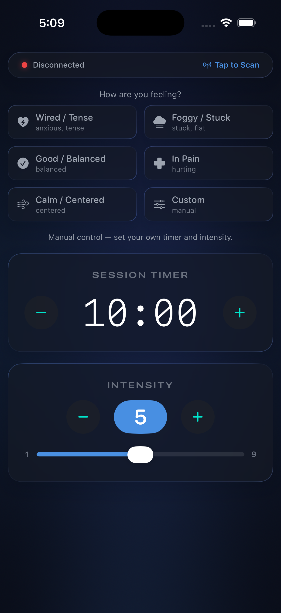
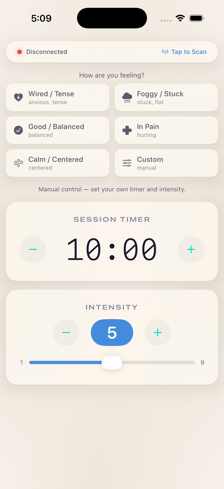

# Pulse-Libre Mobile Application

A React Native application to control the [Pulsetto device](https://juraj.bednar.io/pulsetto) via Bluetooth Low Energy (BLE). The app allows you to set the strength of the device, start a timer, and monitor battery and charging status.

This mobile app is designed for both Android and iOS platforms and mirrors the functionality of the desktop app available [here](https://github.com/jooray/pulse-libre-desktop).

## Screenshots

| Dark mode | Light mode |
|---|---|
|  |  |

## Installation on Android

Add [https://github.com/jooray/PulseLibre](https://github.com/jooray/PulseLibre) to your Obtainium. I don't plan on releasing through Play Store nor F-Droid.

## Features

- Scan and connect to [Pulsetto devices](https://pulsetto.myshopify.com/products/meet-pulsetto-v3?sca_ref=6511019.cCZ7LMhOmo) automatically.
- Set strength levels from 1 to 9.
- Start and stop a timer (default 4 minutes).
- Display battery level and charging status.
- Compatible with Android and iOS devices.
- Does not require Internet permission. No tracking. It needs location and bluetooth permission - location is because Bluetooth scanning could reveal your location, so scanning does not work otherwise. But since there is no Internet permission, the app can't do anything with the location anyway.

## Prerequisites

- [Node.js](https://nodejs.org/) version 18 or higher.
- [React Native CLI](https://reactnative.dev/docs/environment-setup) for native build capabilities.
- Android Studio and/or Xcode for compiling and running the app.
- A physical or virtual Android/iOS device for testing.

## Installation

1. **Clone the repository**

   ```bash
   git clone https://github.com/jooray/PulseLibre.git
   cd PulseLibre
   ```

2. **Install dependencies**

   ```bash
   npm install
   ```

3. **Configure your environment**
   - Follow the [React Native CLI environment setup guide](https://reactnative.dev/docs/environment-setup) to configure your machine for building Android and iOS apps.
   - For Android, ensure Android Studio is installed and properly configured.
   - For iOS, ensure Xcode is installed (macOS only).

## Running the Application

### Android

```bash
npx react-native run-android   
```

### iOS (macOS only)

1. **Install CocoaPods dependencies**:
   ```bash
   cd ios
   pod install
   cd ..
   ```

3. **Compile and run the app on an iOS simulator/device**:
```bash
npx react-native run-ios
```

## Usage

- Upon starting, the app will attempt to scan and connect to a Pulsetto device.
- If a device is not found, a "Scan" button will appear. Press it to scan again.
- Once connected, battery level and charging status will be displayed.
- Use the slider to set the desired strength (1-9).
- Press the "Start" button to begin the timer and activate the device.
- Press the "Stop" button to stop the device and the timer.
- While the device is running, you can adjust the strength slider to change the intensity without affecting the timer.

## Why? Backstory

I was stranded in a car in a storm. The storm took out all the cell towers. With nothing
to do, I decided to do some biohacking, chill out, use some Near Infrared Light, and
do some vagal stimulation to remove the stress of the freaking wind that was shaking my car
and throwing over reusable bathrooms around me.

I turned the device on, but it needed to log in and go to the internet. Which was, of course,
not working because of the storm.

Why does an electric nerve stimulator need an account and access to the Internet? I sighed.
A few moments later, I wanted to learn about BLE hacking and reverse engineering. The code
was written mostly by ChatGPT anyway, but I did some nice reverse engineering of the protocol.
The result is this micro app. Have fun.

## Information about Pulsetto Device

The device's original app has multiple modes (Stress, Pain, Burnout, ...), but
they are actually all the same, just with different recommendations on how often to do
them and different program lengths. There is no difference in what the device does.

The only thing that you set on your device is the strength level (1-9), and the
app starts a timer.

Get your [Pulsetto device](https://juraj.bednar.io/pulsetto).

## Related Projects

For a desktop application with similar functionality, check out the [Pulsetto Desktop App](https://github.com/jooray/pulse-libre-desktop). Compatible with Windows, macOS, and Linux.

Enjoy biohacking and take control of your Pulsetto device on mobile! 🚀

## Note on building the APK

```bash
cd android
./gradlew clean assembleRelease
```

This will generate a release APK at: android/app/build/outputs/apk/release/app-release.apk
